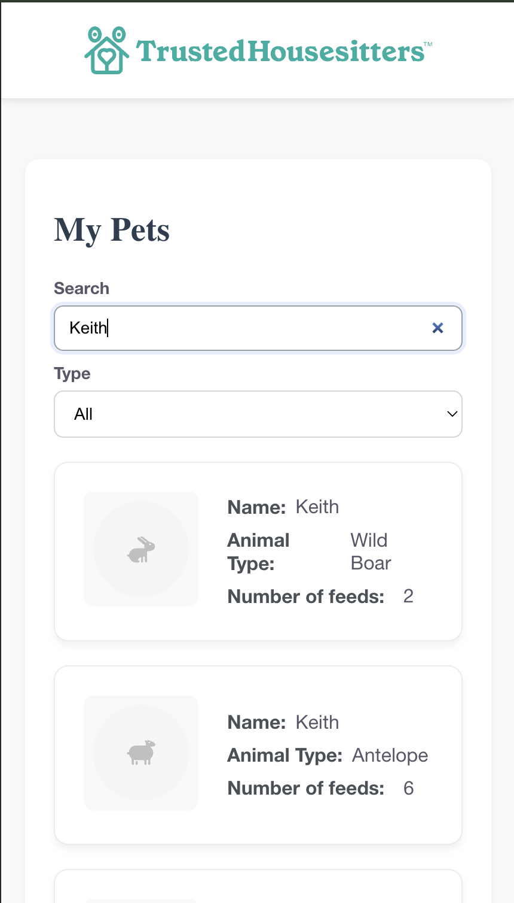

# TrustedHousesitters – Pet Listing App

It is a React web application designed for a technical assessment. It fetches and displays pet listings from a mock API, provides a responsive grid layout, and allows users to search and filter pets by type.

The app also includes **pet categorization logic** that maps animal types to one of eight categories, each with its own SVG placeholder image.

## Screenshots

### Pet List View


### Search & Filter


### Mobile View


---

## **Frontend**

### Navigate to Directory

```sh
cd interview-questions-public/web
```

### Install Dependencies

```sh
npm install
```

### Run (Development)

```sh
npm run dev
```

Then open the provided URL in your browser (default: `http://localhost:5173`).

---

## **Mock API (MSW)**

This project uses [Mock Service Worker (MSW)](https://mswjs.io/) to intercept `/api/pets` requests and return mock pet data.
No extra server setup is required — it runs automatically in development.

---

## **Tests**

### Run Unit Tests

```sh
npx vitest --config vite.config.js
```

The tests cover:

* **PetList** – fetches pets, handles loading/error states, filters by search/type.
* **SearchFilter** – responds to input changes and renders available filter options.
* **PetItem** – displays pet details and the correct placeholder icon.

---

## **Access URLs**

* **Frontend:** [http://localhost:5173](http://localhost:5173)

---

## **Features**

* **Fetch & Display Pets:** Data from `/api/pets` displayed in a responsive grid.
* **Search & Filter:** Search by pet name/type; filter by animal type.
* **Categorization:** 8 SVG placeholders (Dog, Cat, Farm Animal, Fish, Horse, Poultry, Reptile, Small Pet) chosen dynamically via `utils.js`.
* **Responsive UI:** Adapts to mobile, tablet, and desktop layouts.
* **Test Coverage:** Component behavior verified with Vitest + React Testing Library.

---